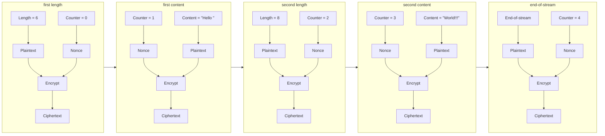

# secret-channel

_Work in progress_

Streaming authenticated encryption using ChaCha20-Poly1305 ([RFC 8439](https://datatracker.ietf.org/doc/html/rfc8439)) (or other [AEAD constructions](https://libsodium.gitbook.io/doc/secret-key_cryptography/aead)).

`secret-channel` is designed to be easy to implement and provide [security guarantees](#security-guarantees) (if you abide by the [pre-requisites](#pre-requisites)).

(Note: This has not been audited to be safe. Use at your own risk.)

## Pre-requisites

- The channel must be reliable and ordered: i.e. TCP.
- Each channel key must be an ephemeral key for a single channel and discarded when the channel ends.
    - To get an ephemeral key for a session, you should do a secure key exchange, such as [`secret-handshake`](https://github.com/auditdrivencrypto/secret-handshake).
- For a duplex (bi-directional) connection between peers, you should create two secret channels (with separate keys), one in each direction.
- A (key, nonce) pair must NEVER be re-used.

## Security Guarantees

`secret-channel` protects the stream from:

- Stream truncation: avoided by checking for "end-of-stream" as the final chunk.
- Chunk removal: the wrong nonce would be used, producing an AEAD decryption error.
- Chunk reordering: the wrong nonce would be used, producing an AEAD decryption error.
- Chunk duplication: the wrong nonce would be used, producing an AEAD decryption error.
- Chunk modification: this is what an AEAD is designed to detect.

## Stream

```txt
+---------------------+-------------------------------------------------------+
|    length chunk     |       content chunk       | ... | end-of-stream chunk |
+---------------------+---------------------------+-----+---------------------+
| 2B length + 16B tag | variable length + 16B tag | ... | 2B zeros + 16B tag  |
+---------------------+---------------------------+-----+---------------------+
```



## Example

TODO

```shell
```

## Design

Data is sent over the channel in chunks.

- Either ([Length](#length-chunk), [Content](#content-chunk)) chunk pairs,
- or a single ([End-of-stream](#end-of-stream-chunk)) chunk.

Each chunk MUST have a unique nonce.

### Nonces

To ensure unique nonces over the channel session, we will use a simple counter.

The counter starts at 0 and increments by 1 with every chunk.

(This is okay because 1) we will never re-use a key, and 2) a 256-bit key protects against [batch/multi-target attacks](https://blog.cr.yp.to/20151120-batchattacks.html).)

Since the ChaCha20-Poly1305 nonce is 12 bytes (96-bits), we will use a 64-bit unsigned integer as our counter sequence number.

The 64-bit counter sequence number is encoded to the 96-bit nonce as follows:

```txt
nonce:
+-----------------+-------------+
| sequence number |   padding   |
+-----------------+-------------+
|   8B (u64_le)   | 4B (0x0000) |
+-----------------+-------------+
```

If the counter sequence number overflows, the channel MUST end. (This is not expected to happen.)

### Chunks

#### Length chunk

We start with a length chunk, seen here in plaintext:

```txt
2 byte length (plaintext):
+---------------+
|     length    |
+---------------+
|  2B (u16_le)  |
+---------------+
```

The length is a 16-bits unsigned integer (encoded as little-endian).

(The maximum content length is 2^16 bytes or 65,536 bytes or 65.536 Kb)

A length of `0` is not a valid length. (And instead refers to a [End-of-stream chunk](#end-of-stream-chunk))

We encrypt and authenticate the length with ChaCha20-Poly1305 into the following ciphertext:

```txt
18 byte length (ciphertext):
+------------------+------------+
| encrypted length |  auth tag  |
+------------------+------------+
|        2B        |    16B     |
+------------------+------------+
```

#### Content chunk

A content chunk is simply the content.

From 0 to 2^16 (65,536) bytes. (Matching the length in the previous chunk.)

If content is larger than 2^16 (65,536) bytes, split the bytes across multiple chunks.

```txt
Variable length content (plaintext):
+-----------------+
|    content      |
+-----------------+
| variable length |
+-----------------+
```

Then encrypted and authenticated with ChaCha20-Poly1305.

```txt
Variable length content (ciphertext):
+----------------------+------------+
| content (ciphertext) |  auth tag  |
+----------------------+------------+
|    variable length   |    16B     |
+----------------------+------------+
```

### End-of-stream chunk

A end-of-stream chunk is 2 bytes (the size of a [Length chunk](#length-chunk)) of all zeros.

```txt
2 byte end-of-stream (plaintext):
+---------------+
| end-of-stream |
+---------------+
|   2B zeros    |
+---------------+
```

Then encrypted and authenticated with ChaCha20-Poly1305.

```txt
18 byte end-of-stream (ciphertext):
+-----------------+------------+
| encrypted zeros |  auth tag  |
+-----------------+------------+
|        2B       |    16B     |
+-----------------+------------+
```

## References

- [STREAM: "Online Authenticated-Encryption and its Nonce-Reuse Misuse-Resistance"](https://eprint.iacr.org/2015/189.pdf).
- [Rust implementation of STREAM](https://docs.rs/aead/latest/aead/stream/index.html)
- [StackExchange post on streaming authenticated encryption](https://crypto.stackexchange.com/a/106992)
- [shadowsocks SIP022 AEAD-2022](https://github.com/shadowsocks/shadowsocks-org/blob/main/docs/doc/sip022.md)
- [libsodium: Encrypting a set of related messages](https://libsodium.gitbook.io/doc/secret-key_cryptography/encrypted-messages)
- [ChaCha20-Poly1305 Cipher Suites for Transport Layer Security (TLS)](https://www.rfc-editor.org/rfc/rfc7905)
